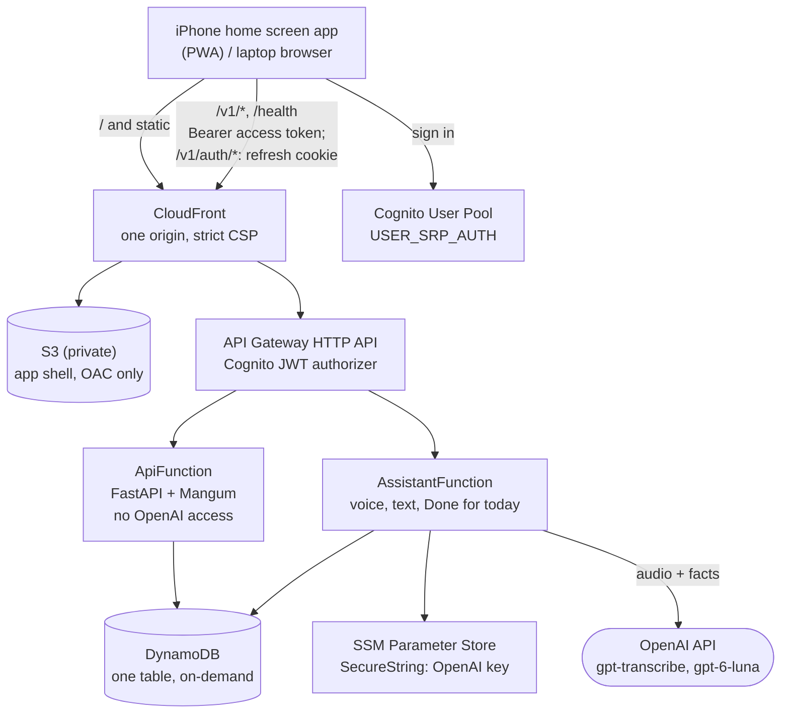

# Workout Log

A one-page workout log you can talk to. Say what you just did, and it gets
logged. Say "done for today", and it writes a short summary of the day.

It replaces a Claude artifact of the same name with a real app: the same
screens and rules, but the data lives in your own AWS account, the app installs
to an iPhone home screen, and the assistant runs on your own OpenAI key.

**Status:** all 7 phases complete. Sign-in, the Day tab, Trends, Progress,
Export CSV, voice logging, "Done for today", and an importer for the old log.
Follow the docs in order to deploy it. See [Build phases](#build-phases).

---

## What it does

- **Day tab** - a calendar, the day's exercises, stat tiles, an editable day
  summary, notes and bodyweight, and a gym/home switch.
- **Trends tab** - workouts per week, a GitHub-style heatmap, sets per muscle
  over a range, and the areas you have not worked.
- **Progress tab** - per-exercise history and a top-set chart.
- **Voice** - tap the mic, say "seated row, 3 sets of 10 to 12 at 40 pounds",
  and it is logged. Corrections, removals, and questions about past workouts
  work the same way.
- **Done for today** - writes the day's summary once. After that you edit it
  yourself.
- **Export CSV** - one row per set.
- **Offline** - the app opens and shows the last loaded data with no network.
  Writes and voice need a connection.

## Architecture



The app and the API share one CloudFront origin, so there is no CORS anywhere.
Only `AssistantFunction` can read the OpenAI key, and it is the only place that
imports the OpenAI SDK.

## Repo map

```
shared/
  exercise_catalog.json     muscle vocabulary, name lookup, common names
  fixtures/                 golden cases, run by BOTH pytest and node --test
backend/
  template.yaml             the whole AWS stack
  requirements-dev.txt      test and lint deps
  src/requirements.txt      runtime deps, pinned (packaged with the Lambdas)
  src/workoutlog/
    logic.py                workout rules - twin of web/js/logic.js
    models.py               Pydantic validation
    repo.py                 DynamoDB: optimistic locking, the sync ETag
    service.py              day operations, shared by routes and AI tools
    auth.py                 JWT claims -> User
    sessions.py             the refresh-token cookie: /v1/auth/*
    errors.py               the {"error": {...}} envelope
    idempotency.py          a write runs at most once per Idempotency-Key
    api_app.py              ApiFunction  (no OpenAI access)
    assistant_app.py        AssistantFunction (the only OpenAI caller)
    summary.py              facts for "Done for today", computed in code
    export_csv.py           CSV, twin of web/js/csv.js
    assistant/              OpenAI client, prompts, summarizer
      agent.py              the assistant loop: context in, tool calls out
      tools.py              what the model may do, all through service.py
      transcribe.py         speech to text, primed with your exercise names
      metrics.py            tokens, audio seconds and dollars, as an EMF line
  tests/
web/                        static app: no build step, no runtime npm deps
  index.html, css/app.css   the shell: header, status line, tabs
  js/                       app, session (tokens in memory), api, sync, store
  js/logic.js               workout rules - twin of backend logic.py
  js/views/day.js           the Day tab; views/editor.js the Add/Edit dialog
  js/views/trends.js        Trends; views/progress.js the top-set chart
  js/csv.js                 Export CSV, twin of backend export_csv.py
  js/voice.js               the mic, the recorder and the result card
  sw.js                     service worker: caches the shell, never /v1/*
  vendor/                   amazon-cognito-identity-js, pinned
  tests/                    node --test, no dependencies
scripts/                    deploy, users, keys, smoke test, secret scan
  import_legacy.py          brings the old log in, from JSON or the old CSV
docs/                       follow these in order
```

[docs/code-map.md](docs/code-map.md) goes file by file: what each one does,
and where to look for a given error or change.

## Where to start

Follow the docs in this order:

| Doc | What it gets you |
| --- | --- |
| [docs/01-prerequisites.md](docs/01-prerequisites.md) | Tools installed and verified |
| [docs/02-aws-account.md](docs/02-aws-account.md) | An AWS account you can deploy from safely |
| [docs/03-openai-key.md](docs/03-openai-key.md) | An OpenAI key stored in AWS, never in the repo |
| [docs/04-deploy-backend.md](docs/04-deploy-backend.md) | The stack deployed |
| [docs/05-users-and-permissions.md](docs/05-users-and-permissions.md) | Your user, and AI access |
| [docs/06-deploy-web-and-install.md](docs/06-deploy-web-and-install.md) | The app on your home screen |
| [docs/07-migrate-old-log.md](docs/07-migrate-old-log.md) | Your old log imported |
| [docs/08-testing.md](docs/08-testing.md) | How to check everything works |
| [docs/09-operations-and-costs.md](docs/09-operations-and-costs.md) | Running it, and what it costs |

[docs/00-architecture.md](docs/00-architecture.md) explains why each piece was
chosen. Read it when you want the reasoning rather than the steps.
[docs/code-map.md](docs/code-map.md) says what each file does.

## Running the tests now

```bash
make venv
make test
make check-secrets
```

`make venv` is needed once: it creates `.venv` and installs the dependencies.
`make test` runs the backend tests, then the frontend tests.
Run `make check-secrets` before every commit.

Expected: `275 passed` for the backend, `# fail 0` for the frontend, then
`check-secrets: OK`.

To deploy, follow docs 02 to 06; the short version is `make deploy`,
`make deploy-web`, then `make smoke`.

## Build phases

| Phase | What | Status |
| --- | --- | --- |
| 1 | Backend core, local only | **done** |
| 2 | AWS: SAM template, scripts, deploy | **done** |
| 3 | Web foundation: shell, sign-in, PWA | **done** |
| 4 | Day tab | **done** |
| 5 | Trends, Progress, Export CSV | **done** |
| 6 | AI: assistant, voice UI, Done for today | **done** |
| 7 | Migration, docs, parity checklist | **done** |
